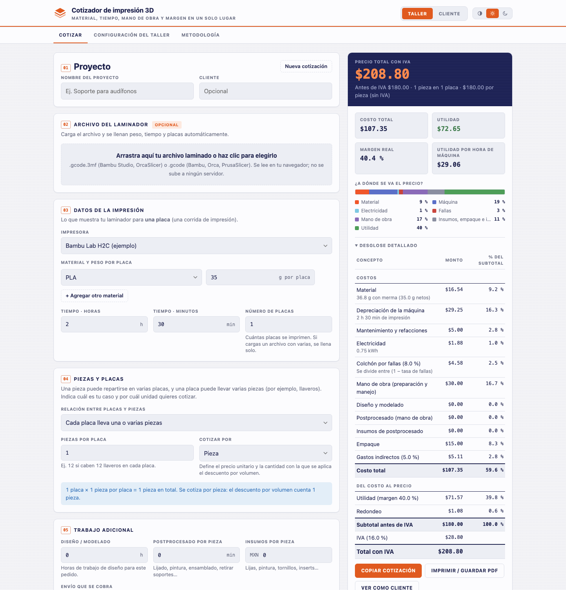
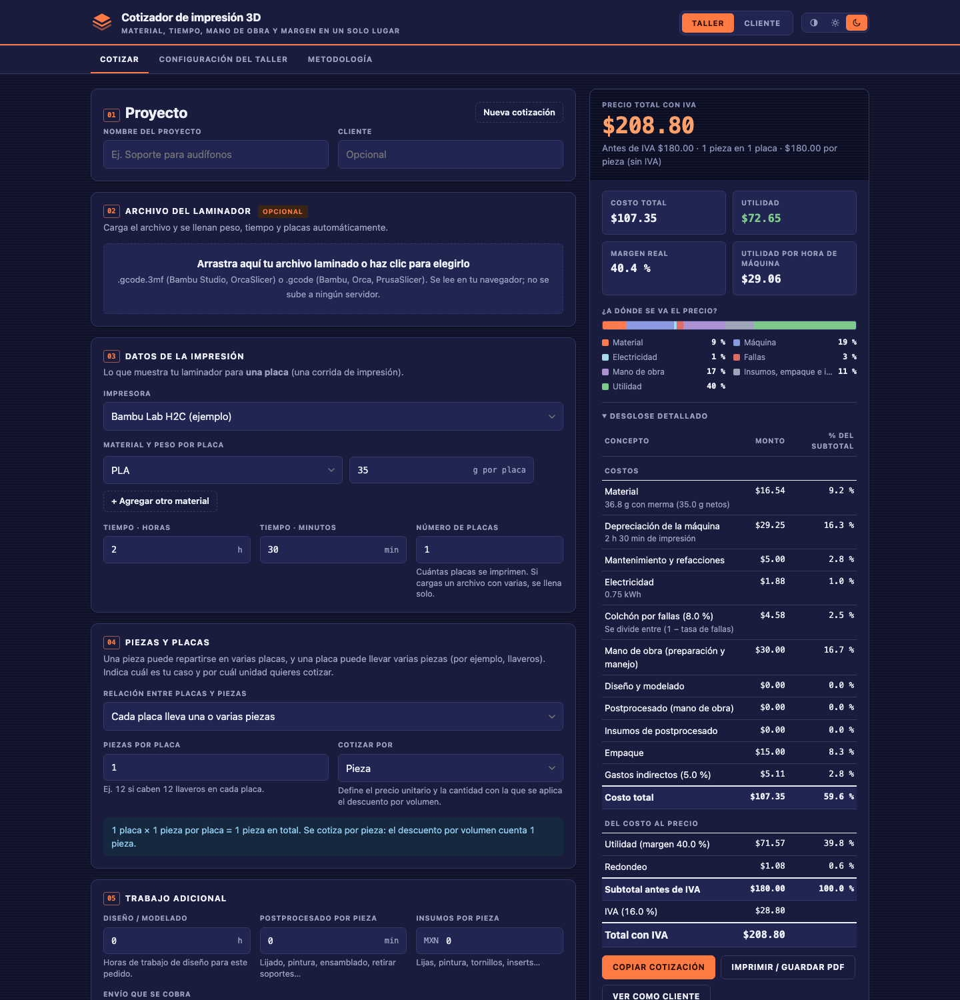

# Cotizador de Impresión 3D

[](https://ainxstep.github.io/cotizador-impresion-3d/)
[](LICENSE)
[](https://github.com/AINxStep/cotizador-impresion-3d/actions/workflows/tests.yml)

Calculadora en línea para cotizar proyectos de impresión 3D con **todos los costos** a la vista: material, tiempo de máquina, electricidad, mano de obra, fallas, postprocesado, empaque, comisiones, margen e IVA.

Es una página estática (HTML + CSS + JavaScript, sin servidor ni dependencias), pensada para quien se dedique a la impresión 3D, con dos modos:

- **Taller:** cada persona configura sus propias impresoras, materiales y tarifas, y ve el desglose completo de costos, utilidad y margen real.
- **Cliente:** muestra únicamente el precio y un resumen. Se puede compartir un enlace de **cotización cerrada** (sólo lectura, con tu precio exacto) o de la **calculadora** (precios aproximados +10 %, con aviso de que la cotización real la emite el taller) — ambos llevan **sólo tus tarifas de venta**, nunca tus costos, márgenes ni utilidad.

<p align="center">
  
  
</p>

## Contenido

- [Qué incluye](#qué-incluye)
- [Generar el archivo del laminador](#cómo-generar-el-archivo-para-subirlo-a-la-página)
- [Piezas y placas](#piezas-y-placas)
- [Cómo se calcula](#cómo-se-calcula)
- [Usarlo](#usarlo)
- [Publicar en GitHub Pages](#publicar-en-github-pages)
- [Pruebas](#pruebas)
- [Estructura](#estructura)
- [Ideas para más adelante](#ideas-para-más-adelante)

## Qué incluye

- Desglose por concepto y gráfica de "¿a dónde se va el precio?", con utilidad, margen real y utilidad por hora de máquina.
- **Lee el archivo del laminador:** arrastra un `.gcode.3mf` (Bambu Studio, OrcaSlicer) o un `.gcode` (Bambu, Orca, PrusaSlicer) y se llenan peso por filamento, tiempo y placas por corrida. El archivo se procesa en el navegador; no se sube a ningún servidor. [Paso a paso para generarlo](#cómo-generar-el-archivo-para-subirlo-a-la-página).
- **Corridas, placas y piezas:** el material y el tiempo se capturan como **totales por corrida** (todo el proyecto con todas sus placas, aunque sean distintas entre sí), más las **placas por corrida** y las **corridas** que repiten el proyecto para cubrir el pedido. Las piezas se deducen de las placas totales según la relación que indiques, y eliges si cotizas **por pieza o por placa**. [Cómo funciona](#piezas-y-placas).
- Varias impresoras (depreciación, mantenimiento y consumo eléctrico por hora) y varios materiales (costo por gramo).
- Módulos opcionales que se activan o desactivan: diseño y modelado, postprocesado e insumos, multicolor y purga, empaque, comisiones de plataforma o cobro, pedido mínimo, recargo por urgencia y descuento por volumen.
- Margen sobre el precio **o** multiplicador sobre el costo, con la equivalencia entre ambos.
- Moneda configurable (MXN por defecto), IVA opcional y redondeo del precio hacia arriba. El IVA se puede apagar **por cotización** — útil para trabajos entre particulares: al desmarcarlo no se suma ni se menciona en la cotización del cliente.
- Cotización para el cliente: copiar como texto o **descargar como PDF** con un clic — el documento se genera en el navegador, sin diálogo de impresión (siempre sin costos internos).
- Enlace para clientes, respaldo de la configuración en un archivo JSON y selector de tema claro, oscuro o automático.
- Botón **Nueva cotización**: limpia los datos del trabajo (pesos, tiempos y archivo importado) para empezar de cero sin restos de la cotización anterior.
- Tu configuración y el trabajo en curso se guardan sólo en tu navegador (`localStorage`).
- **Primera visita guiada:** si aún no has guardado configuración, la página abre en *Configuración del taller* con un aviso para ajustar tus datos antes de cotizar.
- **Ayuda en cada campo:** todos los campos de Cotizar y de Configuración llevan un icono **«?»** que muestra la explicación concreta del campo al pasar el cursor (o al enfocarlo con el teclado).

> Todos los valores iniciales son **ejemplos**. Reemplázalos con los de tu taller en la pestaña *Configuración del taller*.

## Cómo generar el archivo para subirlo a la página

La página no lee el modelo 3D (STL, OBJ ni un 3MF de proyecto). Lee el **archivo ya laminado**: el que el laminador genera después de calcular la impresión. De ahí toma, por cada placa, el tiempo estimado y los gramos de cada filamento. Formatos que acepta:

| Formato | Lo generan | Qué se llena |
|---|---|---|
| `.gcode.3mf` (recomendado) | Bambu Studio, OrcaSlicer | Tiempo y gramos por filamento de cada placa, con el tipo de material (PLA, PETG…) |
| `.gcode` | Bambu Studio, OrcaSlicer, PrusaSlicer, SuperSlicer, Cura | Tiempo y gramos totales. Cura sólo trae el tiempo: el peso se captura a mano |

**Antes de exportar**, deja el proyecto tal como lo vas a imprimir: elige la impresora, el filamento y el perfil de calidad reales, y acomoda en la placa todas las piezas del pedido. El peso y el tiempo dependen de esa configuración; si cambias algo, vuelve a laminar y a exportar.

### Bambu Studio

1. Abre el modelo. Arriba a la izquierda comprueba que estén la impresora y la boquilla correctas y que cada objeto tenga su filamento y su perfil.
2. Pulsa **Slice plate** (laminar la placa) o `Ctrl+R`. Al terminar se abre la vista previa con el tiempo estimado y el peso del filamento.
3. Ve a **File → Export → Export plate sliced file** (menú Archivo → Exportar → archivo de placa laminada). También está en la flecha junto al botón *Print plate*. Se guarda como `nombre.gcode.3mf`.
4. Si el pedido tiene varias placas, pulsa **Slice all** y usa **File → Export → Export all plate sliced file** para obtener un solo archivo con todas.
5. Alternativa: **File → Export → Export G-code** genera un `.gcode` simple. Es preferible el `.gcode.3mf`, porque trae el peso separado por filamento y por placa.

> **Ojo:** *Save Project* y *Save Project As* guardan un `.3mf` de proyecto, que no lleva peso ni tiempo. La página lo rechaza con el aviso de que no trae datos de laminado. Hay que exportar el archivo de placa laminada.

### OrcaSlicer

1. Configura impresora, filamento y proceso, y lamina con **Slice plate** (`Ctrl+R`).
2. Exporta con **File → Export → Gcode.3MF** (recomendado) o **File → Export → G-code**. En algunas versiones la primera opción aparece como *Export plate sliced file*.
3. Si tu versión ofrece **Export all plate sliced file**, úsala cuando el pedido tenga varias placas.

### PrusaSlicer y SuperSlicer

1. Elige los perfiles de impresora, filamento e impresión y pulsa **Slice now** (`Ctrl+R`).
2. Pulsa **Export G-code** (abajo a la derecha, `Ctrl+G`) y guarda el `.gcode`.
3. Si el archivo sale como `.bgcode` (G-code binario), la página no lo puede leer. Desactiva **Supports binary G-code** en *Printer Settings* (o el interruptor global en *Preferences → Other*) y exporta otra vez.

### Cura

1. Pulsa **Slice** y luego **Save to Disk**.
2. El G-code de Cura incluye el tiempo estimado pero no el peso. La página lee el tiempo y te avisa que captures los gramos a mano; los encuentras en el panel de estimación de Cura, junto al tiempo.

### Subirlo a la página

1. Abre https://ainxstep.github.io/cotizador-impresion-3d/ (o tu propia publicación) en el modo **Taller**, pestaña *Cotizar*.
2. En la tarjeta **Archivo del laminador**, arrastra el archivo o haz clic para elegirlo. Se lee en tu navegador; no se sube a ningún servidor.
3. Se llenan solos el peso por filamento, el tiempo y las placas por corrida (y el nombre del proyecto, si estaba vacío) — los **totales de una corrida**: todas las placas del archivo sumadas. Con varias placas puedes usar todas o sólo una en el desplegable *Usar en la cotización*, y si el pedido repite el proyecto, ajusta las *corridas*.
4. Revisa el **material asignado**: si el tipo de filamento del archivo (PLA, PETG…) coincide con el nombre de un material de tu configuración, se elige solo; si no, se usa el primero y se indica "sin coincidencia". Cámbialo en el desplegable si hace falta.
5. **Indica cómo se relacionan las placas con las piezas.** El archivo sólo trae las placas; no puede saber si forman una sola pieza o varias. Si trae más de una, la página te pregunta con dos botones (*Las N placas forman una sola pieza* / *Cada placa lleva sus propias piezas*); también puedes cambiarlo en la tarjeta *Piezas y placas*. Ver [Piezas y placas](#piezas-y-placas).
6. Captura lo que el archivo no trae: diseño, postprocesado, envío y urgencia.

El peso que reporta el laminador ya incluye la torre de purga y el material que se desecha al cambiar de color, por eso la merma por defecto es baja (5 %).

### Problemas frecuentes

| Aviso o síntoma | Causa | Solución |
|---|---|---|
| "Este 3MF no trae datos de laminado" | Se subió el 3MF del proyecto, no el laminado | Lamina y exporta el archivo de placa laminada (`.gcode.3mf`) |
| "Formato no soportado" | Se subió un STL, OBJ, `.bgcode` u otro formato | Exporta un `.gcode.3mf` o un `.gcode` |
| "El G-code no incluye el peso del filamento" | El laminador no escribe el peso en el archivo (por ejemplo, Cura) | Captura los gramos a mano |
| "No se encontraron estadísticas de peso ni de tiempo" | El G-code no tiene los comentarios de estadísticas | Exporta de nuevo desde el laminador o usa el `.gcode.3mf` |
| El tiempo o el peso no coinciden con el laminador | Se cambió el perfil o las piezas después de exportar | Vuelve a laminar y a exportar |
| "Tu navegador no soporta DecompressionStream" | Navegador antiguo | Actualiza el navegador o captura los datos a mano |

## Piezas y placas

Los datos de impresión se capturan como **totales por corrida**: una corrida es imprimir todas las placas del proyecto una vez. Así no importa que las placas sean distintas entre sí (por ejemplo, las tapas en una placa y las bases en otra): el resumen del laminador ya trae los gramos y el tiempo de todo el conjunto. En la tarjeta *Datos de la impresión* capturas:

- **Material y tiempo por corrida:** los totales del proyecto, tal como los muestra el resumen del laminador.
- **Placas por corrida:** cuántas placas tiene el proyecto en cada corrida.
- **Corridas del proyecto:** cuántas veces se imprime el proyecto completo para cubrir el pedido. Si la misma placa se imprime tres veces, es una corrida de una placa × 3 corridas.

Las **placas totales** del trabajo son placas por corrida × corridas; de ellas dependen el manejo por placa y la purga. Las **piezas** se deducen de las placas totales según la relación que indiques en la tarjeta *Piezas y placas*:

| Caso | Ejemplo | Cómo se indica | Piezas |
|---|---|---|---|
| Cada placa lleva una o varias piezas | 3 placas con 12 llaveros cada una | *Cada placa lleva una o varias piezas* + **piezas por placa** = 12 | placas × piezas por placa = 36 |
| Una pieza se reparte en varias placas | Una figura grande que ocupa 3 placas | *Una pieza se reparte en varias placas* + **placas por pieza** = 3 | placas ÷ placas por pieza = 1 |

*Placas por pieza* admite decimales. Si las placas no son múltiplo exacto (5 placas con 3 placas por pieza), se cotizan 1.67 piezas y la página lo avisa.

**Cotizar por** (pieza o placa) decide dos cosas:

- **El precio unitario** que se muestra en el resultado, en el texto copiado y en el PDF: *precio por pieza* o *precio por placa* (el otro se muestra como equivalencia en el modo Taller).
- **La cantidad con la que se aplica el descuento por volumen.** Los niveles de la configuración (por ejemplo, desde 5 y desde 10) cuentan piezas o placas según lo elegido.

Qué depende de qué: el **material, el tiempo de máquina, la electricidad y las fallas** dependen de las **corridas**; el **manejo y la purga** dependen de las **placas totales**; el **postprocesado y sus insumos** dependen de las **piezas**. Cambiar la relación o la unidad de cotización no cambia el costo del trabajo; el total sólo se mueve si el descuento por volumen cambia de nivel o si hay postprocesado (que se cobra por pieza).

Cuando cargas un archivo, la página reinicia la relación (varias piezas por placa, 1 pieza por placa), lo toma como **una corrida** y, si el archivo trae más de una placa, te pide indicarla. Las sesiones guardadas antes de esta función siguen funcionando: los gramos y el tiempo por placa se convierten a totales por corrida al abrir la página.

## Cómo se calcula

```
Material     = Σ gramos_por_corrida × corridas × (1 + merma) × precio_por_gramo
Máquina      = horas_por_corrida × corridas × [ precio × (1 − rescate) / vida_útil + mantenimiento_por_hora ]
Electricidad = horas × (watts / 1000) × precio_kWh
Con fallas   = (Material + Máquina + Electricidad) / (1 − tasa_de_fallas)

Costo        = Con fallas + mano de obra + diseño + postprocesado + insumos + empaque
               + indirectos% × (todo lo anterior)

Precio base  = Costo / (1 − margen)          ó          Costo × multiplicador
             → urgencia → descuento por volumen (por piezas o placas) → comisión → mínimo → envío → redondeo → IVA
```

Puntos importantes:

- **Las fallas se dividen, no se suman:** con 10 % de impresiones perdidas el costo sube 11.1 %, no 10 %.
- **Margen no es sobreprecio:** sumar 30 % al costo produce sólo 23 % de margen. Un margen de 40 % equivale a multiplicar el costo por 1.67.
- **La comisión se calcula "hacia atrás"** (`precio = (base + cargo_fijo) / (1 − comisión)`), para que después de pagarla tu utilidad no baje.
- **Tu tiempo es un costo:** la mano de obra se cobra aunque el trabajo sea tuyo.

La pestaña *Metodología* de la propia página explica cada paso.

### Modo Cliente sin revelar costos

El precio del modo Cliente sale de **tarifas de venta** derivadas de tu configuración (precio por gramo de cada material, por hora de cada impresora, por placa y por pedido). Como el modelo es lineal, esas tarifas reproducen exactamente el mismo precio que el modo Taller. Las pruebas automáticas comprueban ambas cosas: que los precios coinciden y que las tarifas no contienen costos, márgenes ni utilidad.

En *Configuración del taller → Compartir con clientes* hay dos enlaces, ambos codificados en la parte `#c=…` de la URL (no se envía a ningún servidor):

- **Enlace de esta cotización** (recomendado): abre la cotización actual ya calculada y de sólo lectura — el cliente ve el precio exacto que definiste, el desglose público y la vigencia, sin poder modificar nada.
- **Calculadora para clientes:** tu cliente captura sus propios datos (por ejemplo, de un `.gcode` que ya tenga) con tus tarifas **más un 10 % de aproximación**, sin descuentos por volumen aplicados (se anuncian sólo como información), y la página avisa siempre que el precio es sólo orientativo y que la cotización real la emite el taller. Sirve para dar una idea del costo, no para cerrar un precio.

Cualquiera con cualquiera de los dos enlaces puede ver esas tarifas de venta.

## Usarlo

**En línea:** https://ainxstep.github.io/cotizador-impresion-3d/ (publicada con GitHub Pages; si haces tu propia copia, ver la sección de publicación).

**Local:** basta con abrir `index.html`, o servirlo:

```bash
python3 -m http.server 8080   # y abre http://localhost:8080
```

Para compartir enlaces con clientes usa la versión publicada, porque un enlace `file://` sólo funciona en tu computadora.

## Publicar en GitHub Pages

1. En el repositorio: **Settings → Pages**.
2. En *Build and deployment* elige **Deploy from a branch**, rama `main` y carpeta `/ (root)`.
3. En un par de minutos queda disponible en `https://<tu-usuario>.github.io/<nombre-del-repositorio>/`.

> **Al modificar JS o CSS:** los scripts y la hoja de estilos se cargan con una versión en la URL (`js/app.js?v=5`, `css/styles.css?v=5` en `index.html`) para romper la caché del navegador. **Incrementa ese número** (`?v=6`, `?v=7`…) en cada cambio que toque `js/` o `css/`; si no, los visitantes pueden quedarse con una mezcla de archivos viejos y nuevos.

## Pruebas

```bash
npm test
```

Usa el ejecutor de pruebas integrado de Node (18 o superior; no hay dependencias que instalar). Cubren el motor de cálculo (casos verificados a mano, fallas, comisiones, mínimo, descuentos, redondeo, IVA), la relación entre piezas y placas (ambos casos, piezas fraccionarias y descuento por pieza o por placa), la equivalencia entre modo Taller y modo Cliente con cientos de trabajos aleatorios, la ausencia de datos de costo en las tarifas públicas y la lectura de archivos `.3mf` y `.gcode` (los archivos de ejemplo se generan al vuelo; no hay binarios en el repositorio).

## Estructura

```
index.html            Página principal
css/styles.css        Estilos (claro/oscuro, móvil, impresión)
js/calc.js            Motor de cálculo (sin dependencias, corre en navegador y Node)
js/importers.js       Lectura de .gcode.3mf y .gcode (ZIP mínimo, sin librerías)
js/pdf.js             Generación del PDF de la cotización (sin librerías)
js/defaults.js        Valores iniciales de ejemplo
js/ui.js              Constructores de HTML y formato
js/app.js             Estado, eventos y persistencia
tests/                Pruebas y ayudantes para generar archivos de ejemplo
docs/                 Capturas de pantalla usadas en este README
```

## Fuentes consultadas

- [FilaQuote: cuánto cobrar por impresión 3D (2026)](https://filaquote.com/guides/how-much-to-charge-for-3d-printing/)
- [Siraya Tech: fórmula de precios](https://siraya.tech/blogs/news/how-to-price-3d-prints)
- [Mandarin3D: costos ocultos al cotizar](https://mandarin3d.com/blog/how-to-price-3d-printing-jobs)
- [3DPCC: fórmula del costo de impresión 3D](https://3dpcc.news/3d-printing-cost-formula)
- [UnoTV: tarifas domésticas de CFE, junio 2026](https://www.unotv.com/nacional/las-tarifas-domesticas-de-cfe-van-de-1-a-4-pesos-por-kwh-en-junio-de-2026/)
- [Foro de Bambu Lab: consumo de energía de la H2D](https://forum.bambulab.com/t/what-about-effective-energy-consumption/163839)
- [X3D Studios: cómo exportar un archivo laminado desde Bambu Studio](https://x3dstudios.com/blog/how-to-export-sliced-file-bambu-studio)
- [OrcaSlicer Wiki: importar y exportar](https://www.orcaslicer.com/wiki/general_settings/import_export)
- [Foro de OctoPrint: el formato .bgcode de PrusaSlicer](https://community.octoprint.org/t/information-regarding-the-the-new-bgcode-file-format-in-prusa-slicer/55196)

## Ideas para más adelante

- Historial de cotizaciones guardadas y exportación a CSV.
- Estimación de peso y tiempo a partir de un STL.
- Perfiles de material con densidad y temperatura, e interfaz en inglés.

## Aviso

Es una herramienta de estimación. No constituye asesoría fiscal ni contable; revisa con tu contador cómo facturar y qué impuestos aplican.

## Licencia

[MIT](LICENSE)
